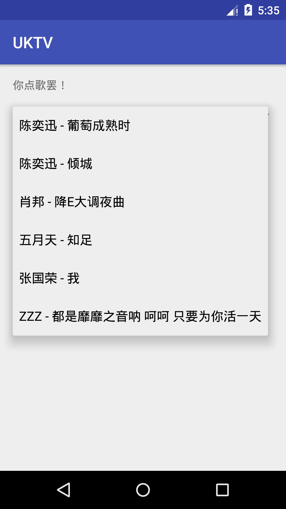

# uKTV
---

# Usage

It plays some music.

1. Select a music
   

2. 切歌, then it plays your selected music
   

# Requirement

It fetches music file from [qiniu.com](qiniu.com), a file server, so it needs network connection.

# 发展

2017-3-27 11:29:24 撅腚本 app 要走向供蟾主义

# TODO

- [x] remove the "TextView"

- [ ] display `.lrc` lyrics

- [ ] pack, sign and upload a `.apk` release

- [ ] RQ want to change the icon of this app

- [ ] 改名叫 pOOl, 中文名 青草池塘 好了

      哎呀, 好像修改冲突了

- [ ] 收集些膜法歌曲

- [ ] 动态绑定内容, 当然啦...

- [ ] 本地缓存. 用上 `sqlite` ?

