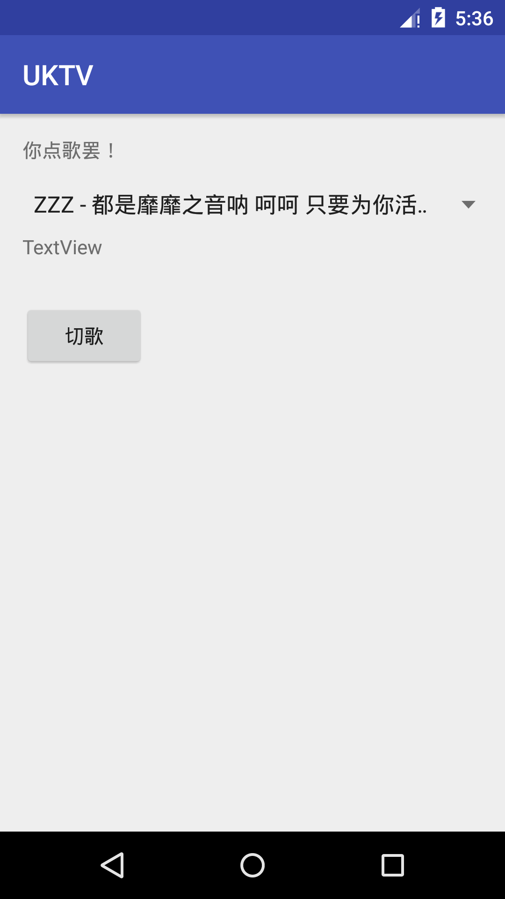

# uKTV
---

# Usage

It plays some music.

1. Select a music

2. 切歌, then it plays your selected music

# Requirement

It fetches music file from [qiniu.com](qiniu.com), a file server, so it needs network connection.

# TODO

- [] remove the "TextView"
- [] display `.lrc` lyrics
- [] pack, sign and upload a `.apk` release
- [] RQ want to change the icon of this app

